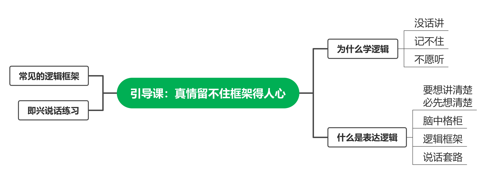

### 001、引导课：真情留不住框架得人心

#### 说话逻辑学的重要性
帮助解决上台无话可说和缺乏逻辑的问题
使讲话条理清晰、层次分明、精彩动人

#### 学习说话逻辑学的原因
工作中常遇到说话啰嗦、无重点、难以记住的问题
通过学习逻辑学，提升讲话的易记性、吸引力和易懂性

#### 说话逻辑学解决的问题
没话讲：通过逻辑学调用大脑中的素材，让讲话有内容
记不住：使用大脑喜欢的记忆方式，如分块处理、图像化、结构化
不愿意听：讲话要有逻辑、通俗易懂，重点突出

#### 说话逻辑学的定义
脑中格柜：把大脑中的内容进行分块处理，方便调用
逻辑框架：使用套路或公式，让讲话有条理、概括性和逻辑性

#### 说话逻辑学练习方法
学习逻辑框架，提高即兴演讲能力
通过练习，达到张口就来的境界，适用于各种场合

#### 说话逻辑学结论
说话逻辑学是提升口才的重要工具
学习并实践逻辑学，可以在工作和生活中更有效地表达自己的观点和想法

